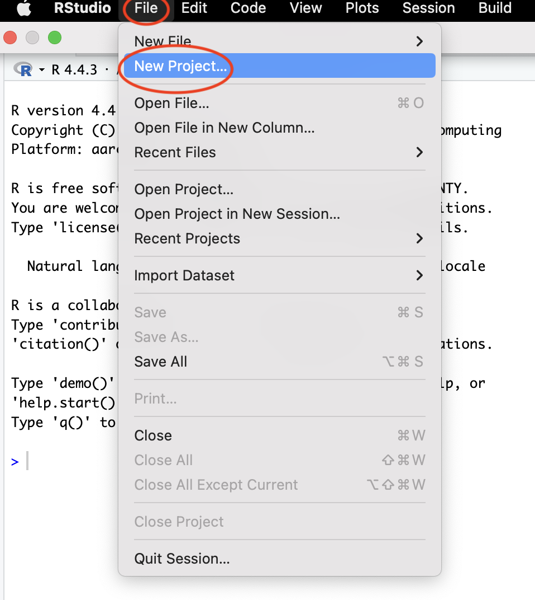
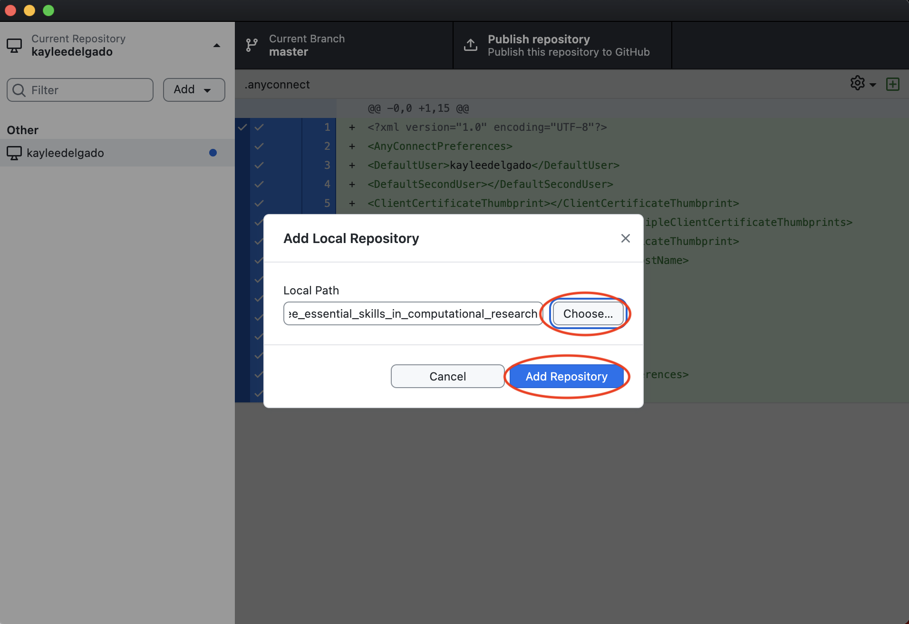
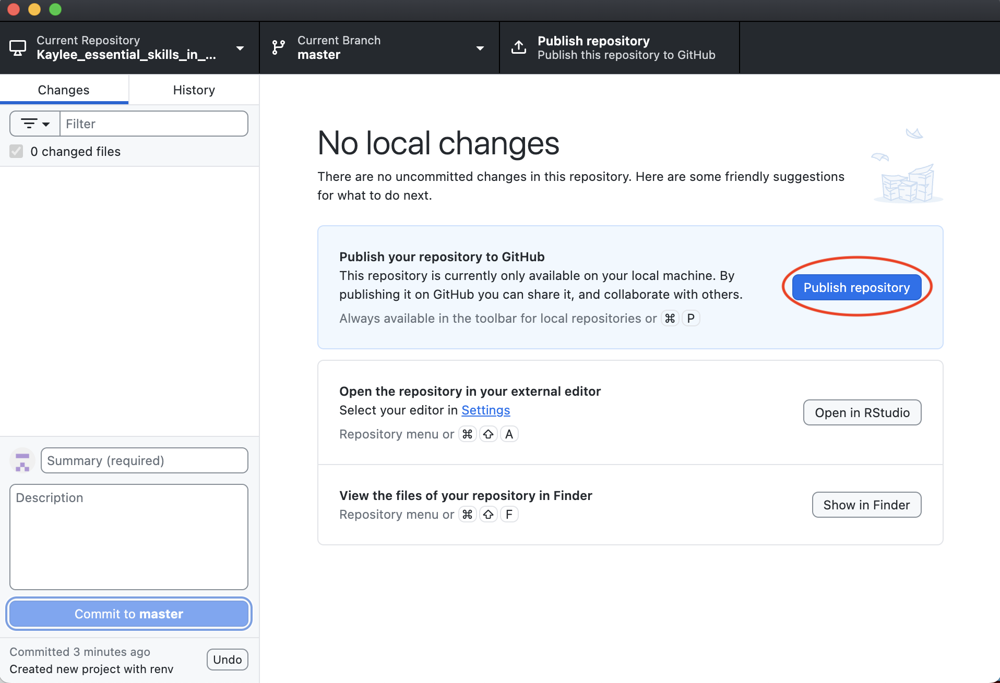

# Chapter 0

In this chapter, you will set up:

- A GitHub account and repository
- An RStudio project with Quarto and `renv`

------------------------------------------------------------------------

## Prerequisites

1.  **Install Required Software**

- [Github Desktop](https://github.com/apps/desktop)
- [R](https://www.r-project.org)
- [RStudio](https://posit.co/download/rstudio-desktop/)
- Quarto and renv (*instructions below*)

2.  **Organization Access**

- Ask your mentor, Holly, or Ellen to add you to the ‘UCSC-Treehouse’
  GitHub organization. **Please include your GitHub id in your
  request.**

------------------------------------------------------------------------

## Setup Instructions

### Create a New Project with renv

In RStudio:

- File –\> New Project –\> New Directory –\> Quarto Project

- When creating your new Quarto project, you want to name it in the
  following format:
  **YourName_essential_skills_in_computational_research**

- Create project in your desktop, unless you want it to be a
  subdirectory of a Vaske Lab or Treehouse folder. In this case, create
  this folder and browse to select it. In the example below, my new
  project will be created as a subdirectory of my lab folder titled
  “Vaske_Lab_Treehouse”.

- Make sure to **select**:

- “Create a git repository”

- “Use renv with this project”

- “Open in new session”

- Make sure to **deselect** (if present)

- “Use visual markdown editor”

- Now click “Create Project”

------------------------------------------------------------------------

## What Happens When You Create a New Quarto Project?

Now you have created your first Quarto project in RStudio! But what does
that actually mean? Let’s **exit** RStudio and navigate to your new
project directory to check it out. What do you see? Let’s break it down.

When you create a new Quarto project, RStudio generates:

- The .Rproj file (opens your project in RStudio)
- The renv folder (stores all of the R packages used in your project)
- The renv.lock file (records the *exact* packages & versions)

You *may* see some extra files… you can ignore them, for now.

------------------------------------------------------------------------

## GitHub Desktop

Since you just created a new project with new files, your GitHub Desktop
should reflect these changes.

Let’s open GitHub Desktop and follow the instructions to add your new
repository (i.e. the directory/workspace your new project exists in.)

1.  **Click “Add” –\> “Add Existing Repository…” –\> “Choose…” –\>
    navigate to your new repository –\> “Add Repository”**

You will see something similar to the following… Keep in mind some
listed files (on the left of your screen) may be different due to
RStudio version differences.

2.  **Push Your New Repository to GitHub**

Now that you have your new repository on GitHub Desktop, you can ‘push’
your work to the main branch (*note*: your ‘main’ branch may be called
‘master’, like mine). When you ‘push’ your work to GitHub, you are
sending the changes you made on your local computer to GitHub’s servers,
where others will view and even collaborate on your code.

To push your work main/master:

1.  Save Your Work

- Make sure all files are saved locally. Since you haven’t written any
  new code or text, your changes (your new project files) should be
  saved and ready to be pushed. For future reference, here is the save
  button.

2.  In **GitHub Desktop**, Commit Your Changes to Main

- Navigate to the description box and type in the required summary:
  - In this case, you can write something like ‘Created new project with
    renv’
- Click ‘Commit \_ files to main/master’

3.  In **GitHub Desktop**, Publish Your Repository

- Now that your work is committed to the main branch, you can ‘Publish
  repository’

- Make sure you are publishing your new repository to the UCSC Treehouse
  organization on GitHub

------------------------------------------------------------------------

## Next Steps:

Now let’s get into some actual data analysis! By the end of Chapter 1,
you will have your first experience with plotting data, as well as
creating branches and pull requests on GitHub.

------------------------------------------------------------------------

**START** with [Chapter
1](https://github.com/UCSC-Treehouse/Essential-skills-for-Treehouse-computational-research/blob/main/Chapter-Instructions/Chapter_01_Instructions.md)
