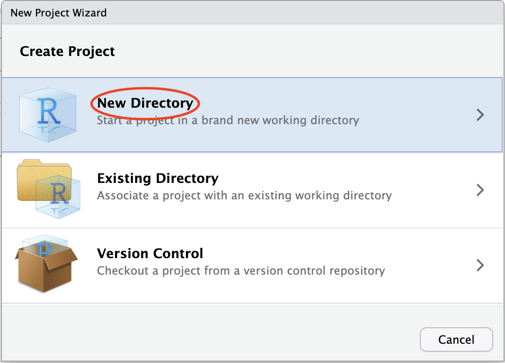
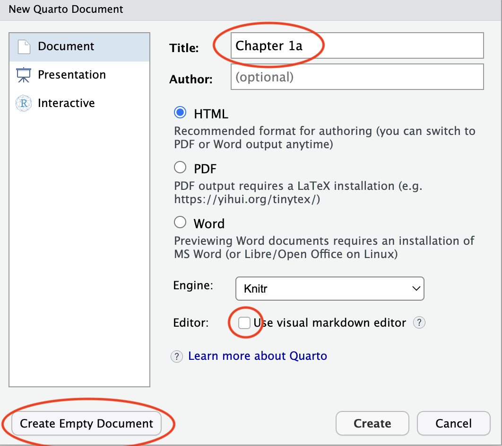
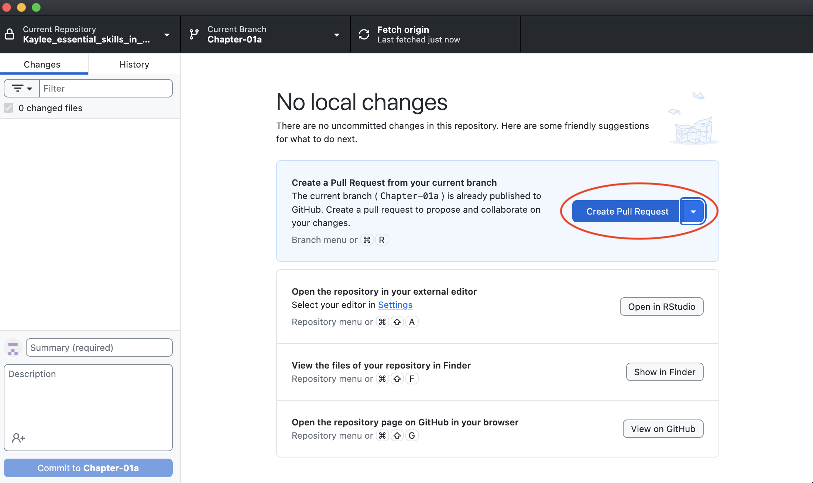

# Chapter 00 Instructions


In this chapter, you will set up:

- A GitHub account and repository
- An RStudio project with Quarto and `renv`

------------------------------------------------------------------------

## Prerequisites

1.  **Install Required Software**

- [Github Desktop](https://github.com/apps/desktop) (use UCSC email)
- [Git](https://git-scm.com/downloads)
- [R](https://www.r-project.org)
- [RStudio](https://posit.co/download/rstudio-desktop/)
- Quarto and renv (*instructions below*)

2.  **Organization Access**

- Ask your mentor, Holly, or Ellen to add you to the ‘UCSC-Treehouse’
  GitHub organization. Please include your GitHub id in your request.

------------------------------------------------------------------------

## Setup Instructions

### Step 1: Create a New Project with renv

1.  In RStudio:

- File –\> New Project –\> New Directory –\> Quarto Project





- When creating your new Quarto project, you want to name it in the
  following format:
  **YourName_essential_skills_in_computational_research**

- Create project in your desktop, unless you want it to be a
  subdirectory of a Vaske Lab or Treehouse folder. In this case, create
  this folder and browse to select it. In the example below, my new
  project will be created as a subdirectory of my lab folder titled
  “Vaske_Lab_Treehouse”.

- Make sure to select **“Use renv with this project”**


Now that you have created your first project, you have a *workspace* to
add all of your computational research to. Next, let’s create notebooks
where you can add work to your space.

2.  Create your first Quarto notebook:

- File –\> New File –\> Quarto Document


- Title and save as ‘Chapter_01’



This is what your new document will look like…


This viewing method is called ‘Visual’. It can give you a nice preview
of what the output document of your code will look like, but it is not
very good for raw text and code.

On the top left, you will want to select “Source” view.


Next, you will want to clear all of that automatic existing code & text.
(hint: if you click ‘Create Empty Document’ instead of just ‘Create’,
you can omit this additional information). Then, change your YAML
heading to the following format:

title: “chapter 01” output: md_document: variant: gfm


Let’s break down this header. Later, when we “render” our document, we
*combine* the raw data, code, and text in our .qmd file into a finished
document. The ‘output: md_document’ ensures that the output is a
markdown file. We want to render to a gfm (GitHub Flavored Markdown),
specifically, as it is best viewed on GitHub.

3.  Enable Reproducibility:

You have already initialized this project with renv, ensuring
consistency of your package versions, and thus consistency when sharing
or reproducing your work. renv takes and saves a “photo” or “snapshot”
of your current packages and versions and restores this exact setup when
reopening or sharing the project. You will do this step each time you
install or update a package. So, to start, let’s install ‘tidyverse’, a
collection of packages designed for clean, or *tidy*, data science.

- In your **R Console**, install ‘tidyverse’ packages:

``` r
install.packages("tidyverse")
```

- In your **R Console**, take a snapshot:

``` r
renv::snapshot()
```

**Note:** In Chapter 01 you will learn another, more concise way to run
these two steps in one step. However, if you forget this, you can always
come back to take a current snapshot by running ‘renv::snapshot()’.

### Step 4: General Workflow

1.  In GitHub Desktop:

- Add Existing Repository –\> Choose… –\> Add Repository


- You will see your recent changes to the document in *red*

- Commit changes to main with message “Initialize project with renv”


*note: your \# of files will be different than mine*

- Create new branch: ‘chapter-01’ (Branch –\> New Branch –\> Create
  Branch)


2.  Push to GitHub:

- Publish repository (first time only)
- Push changes to ‘chapter-01’ branch


**Note:** Your changed files will be *different* than mine. What you
*should* see is what is circled in red. Please make sure you are pushing
your new work to a *new* branch.

3.  Request Review (**once per chapter**)

Upon completion of each chapter, you will ‘submit’ your work to be
reviewed by a mentor.

- Create Pull Request (GitHub Desktop –\> Current Branch –\> chapter-01
  –\> Create Pull Request)



You will be moved to the GitHub browser, where you will add your
reviewer and finalize the pull request. Please write any relevant
description here.

- Assign your mentor as a reviewer. You will need their GitHub id. Here
  I use Holly Beale as an example reviewer.


------------------------------------------------------------------------

## Next Steps:

Repeat this workflow for **each** chapter

1.  Create a Quarto document, changing the YAML header as described
    above
2.  Work on examples, take notes where relevant, & complete the
    exercises
3.  Run ‘renv::snapshot()’ if adding packages
4.  Commit changes to a *new* branch (‘chapter-N’)
5.  Create a pull request for mentor review
