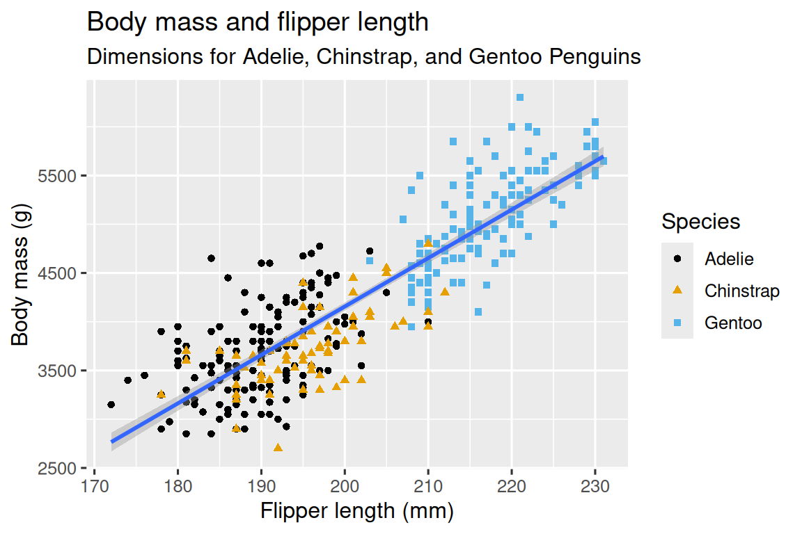
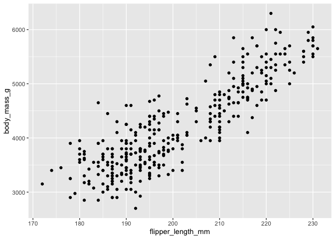
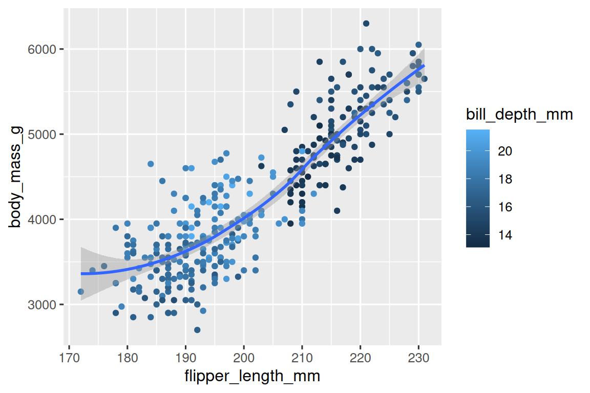

# Chapter 1, Data Visualization


In this first chapter we will explore data visualization with
**ggplot2**: navigating variables, distribution, plots, and varying
aesthetic options.

------------------------------------------------------------------------

## Prerequisites

Install necessary packages to access datasets and plotting functions –\>
copy the commands into your own **R Console**

``` r
# install core packages (run once)
renv::install(c("tidyverse", "palmerpenguins", "ggthemes"))
```

    The following package(s) will be installed:
    - ggthemes       [5.1.0]
    - palmerpenguins [0.1.1]
    - tidyverse      [2.0.0]
    These packages will be installed into "~/Desktop/Vaske_Lab_Treehouse/Essential-skills-for-Treehouse-computational-research/Chapter-Instructions/renv/library/macos/R-4.4/aarch64-apple-darwin20".

    # Installing packages --------------------------------------------------------
    - Installing tidyverse ...                      OK [linked from cache]
    - Installing palmerpenguins ...                 OK [linked from cache]
    - Installing ggthemes ...                       OK [linked from cache]
    Successfully installed 3 packages in 6.6 milliseconds.

Load libraries from installed packages (*run every session*) –\> copy
the commands into your own **quarto notebook (.qmd file)**

``` r
# load tidyverse library (you will use this in most of your data analysis!)
library(tidyverse)
```

    ── Attaching core tidyverse packages ──────────────────────── tidyverse 2.0.0 ──
    ✔ dplyr     1.1.4     ✔ readr     2.1.5
    ✔ forcats   1.0.0     ✔ stringr   1.5.1
    ✔ ggplot2   3.5.2     ✔ tibble    3.2.1
    ✔ lubridate 1.9.3     ✔ tidyr     1.3.1
    ✔ purrr     1.0.4     
    ── Conflicts ────────────────────────────────────────── tidyverse_conflicts() ──
    ✖ dplyr::filter() masks stats::filter()
    ✖ dplyr::lag()    masks stats::lag()
    ℹ Use the conflicted package (<http://conflicted.r-lib.org/>) to force all conflicts to become errors

``` r
# load palmerpenguins library (includes example dataset, run every session)
library(palmerpenguins)
# load ggthemes library (offers colorblind safe color palette)
library(ggthemes)
```

------------------------------------------------------------------------

## Background Info

- A **data frame** is a rectangular collection of **variables** (in the
  columns) and **observations** (in the rows). In the context of
  **palmerpenguins**, a variable refers to an attribute of all the
  penguins, and an observation refers to all the attributes of a single
  penguin.
- In the **tidyverse**, we use special data frames called **tibbles**

------------------------------------------------------------------------

## Creating a ggplot

*end goal*:

<div id="fig-penguins">



Figure 1: Penguin flipper length vs. body mass relationship

</div>

*to begin*: Create a plot with the function ggplot(), which you will add
**layers** to using different **arguments**. The first argument of
ggplot() is the dataset to be used in the graph: ggplot(data = penguins)
creates an empty graph that is primed to display the penguins dataset.

``` r
ggplot(data = penguins)
```


Now we can tell ggplot() how we want to visualize our penguins data. Our
next argument is mapping, where we define how the variables in our
dataset are mapped to visual properties (ie **aesthetics**) of the plot.
The mapping argument is always defined in the aes() function, and the x
and y arguments of aes() specify which variables to map to the x and y
axes. Let’s map flipper length to the x axis and body mass to the y
axis. (*as you type in variable names, you might notice them populate…
select the correct name and press tab to autofill*)

``` r
ggplot(
  data = penguins,
  mapping = aes(x = flipper_length_mm, y = body_mass_g)
)
```


But how will our data be displayed in this now structured graph? First,
we need to define a **geom**: a geometrical object that a plot uses to
represent data. For example, bar charts use bar geoms with geom_bar(),
line charts can be displayed with line geoms using geom_line(), and
boxplots with geom_boxplot(). Let’s create a scatterplot using a point
geom with geom_point():

``` r
ggplot(
  data = penguins,
  mapping = aes(x = flipper_length_mm, y = body_mass_g)
) +
  geom_point()
```

    Warning: Removed 2 rows containing missing values or values outside the scale range
    (`geom_point()`).



You may have noticed the warning message “Warning: Removed 2 rows
containing missing values or values outside the scale range
(\`geom_point())”. We see this message because there are two penguins in
our dataset with missing **values**. This is important and may lead to
common issues we will explore later; but for now we will suppress this
warning so it isn’t printed alongside every plot we make.

We can start to gather conclusions from our positively correlated
scatterplot we have now created, but we should still be skeptical about
the apparent relationship between two variables. Are there any other
variables that explain the relationship? For example, does the
relationship between flipper length and body mass differ by species?
Next, let’s incorporate species into our plot.

``` r
ggplot(
  data = penguins,
  mapping = aes(x = flipper_length_mm, y = body_mass_g, color = species)
) +
  geom_point()
```

    Warning: Removed 2 rows containing missing values or values outside the scale range
    (`geom_point()`).


When a categorical variable is mapped to an aesthetic, ggplot2 will
automatically assign a unique value of the aesthetic (here a unique
color) to each unique level of the variable (each of the three species),
a process known as **scaling**. ggplot2 will also add a legend that
explains which values correspond to which levels.

Let’s add a new layer: a smooth curve to easily visualize the
relationship between the two variables atop the already created
scatterplot. Since this is a new geometric object representing our data,
we will add a new geom as a layer on top of our point geom:
geom_smooth(). We will specify that we want to draw the line of best fit
based on a linear model with method = “lm”.

``` r
ggplot(
  data = penguins,
  mapping = aes(x = flipper_length_mm, y = body_mass_g, color = species)
) +
  geom_point() +
  geom_smooth(method = "lm")
```

    `geom_smooth()` using formula = 'y ~ x'

    Warning: Removed 2 rows containing non-finite outside the scale range
    (`stat_smooth()`).

    Warning: Removed 2 rows containing missing values or values outside the scale range
    (`geom_point()`).


WAIT! This doesn’t look like our *end result* plot… think about why this
may have happened.

Now let’s try to match our expected ggplot which has one line of best
fit. Since we want points to be colored based on species but don’t want
the lines to be separated out for them, we should specify color =
species for geom_point() only.

``` r
ggplot(
  data = penguins,
  mapping = aes(x = flipper_length_mm, y = body_mass_g)
) +
  geom_point(mapping = aes(color = species)) +
  geom_smooth(method = "lm")
```

    `geom_smooth()` using formula = 'y ~ x'

    Warning: Removed 2 rows containing non-finite outside the scale range
    (`stat_smooth()`).

    Warning: Removed 2 rows containing missing values or values outside the scale range
    (`geom_point()`).


Since people have different color perception, let’s also use different
shapes to represent each species of penguin.

``` r
ggplot(
  data = penguins,
  mapping = aes(x = flipper_length_mm, y = body_mass_g)
) +
  geom_point(mapping = aes(color = species, shape = species)) +
  geom_smooth(method = "lm")
```

    `geom_smooth()` using formula = 'y ~ x'

    Warning: Removed 2 rows containing non-finite outside the scale range
    (`stat_smooth()`).

    Warning: Removed 2 rows containing missing values or values outside the scale range
    (`geom_point()`).


For our final touches, let’s improve our labeling using the labs()
function in a new layer. Arguments within labs() include “title”,
“subtitle”, axes “x” and “y”, and legend specifications such as “color”
or “shape”. Finally, we can improve our color palette to be colorblind
safe with the scale_color_colorblind() function from the ggthemes
package.

``` r
ggplot(
  data = penguins,
  mapping = aes(x = flipper_length_mm, y = body_mass_g)
) +
  geom_point(aes(color = species, shape = species)) +
  geom_smooth(method = "lm") +
  labs(
    title = "Body mass and flipper length",
    subtitle = "Dimensions for Adelie, Chinstrap, and Gentoo Penguins",
    x = "Flipper length (mm)", y = "Body mass (g)",
    color = "Species", shape = "Species"
  ) +
  scale_color_colorblind()
```

    `geom_smooth()` using formula = 'y ~ x'

    Warning: Removed 2 rows containing non-finite outside the scale range
    (`stat_smooth()`).

    Warning: Removed 2 rows containing missing values or values outside the scale range
    (`geom_point()`).


Now we have a beautifully labeled scatterplot of penguins’ data that
matches our *end goal*!

------------------------------------------------------------------------

## Exercises pt 1 of 3

1.  How many rows are in penguins? How many columns?

2.  What does the bill_depth_mm variable in the penguins data frame
    describe? Read the help for ?penguins to find out.

3.  Make a scatterplot of bill_depth_mm vs. bill_length_mm. That is,
    make a scatterplot with bill_depth_mm on the y-axis and
    bill_length_mm on the x-axis. Describe the relationship between
    these two variables.

4.  What happens if you make a scatterplot of species vs. bill_depth_mm?
    What might be a better choice of geom?

5.  Why does the following give an error and how would you fix it?

``` r
ggplot(data = penguins) + 
  geom_point()
```

6.  What does the na.rm argument do in geom_point()? What is the default
    value of the argument? Create a scatterplot where you successfully
    use this argument set to TRUE.

7.  Add the following caption to the plot you made in the previous
    exercise: “Data come from the palmerpenguins package.” Hint: Take a
    look at the documentation for labs().

8.  Recreate the following visualization. What aesthetic should
    bill_depth_mm be mapped to? And should it be mapped at the global
    level or at the geom level?

<div id="fig-penguins">



Figure 2: Chapter 1 Exercise pt 1 Question \#8 Plot

</div>

9.  Run this code in your head and predict what the output will look
    like. Then, run the code in R and check your predictions.

``` r
ggplot(
  data = penguins,
  mapping = aes(x = flipper_length_mm, y = body_mass_g, color = island)
) +
  geom_point() +
  geom_smooth(se = FALSE)
```

    `geom_smooth()` using method = 'loess' and formula = 'y ~ x'

    Warning: Removed 2 rows containing non-finite outside the scale range
    (`stat_smooth()`).

    Warning: Removed 2 rows containing missing values or values outside the scale range
    (`geom_point()`).


10. Will these two graphs look different? Why/why not?

``` r
ggplot(
  data = penguins,
  mapping = aes(x = flipper_length_mm, y = body_mass_g)
) +
  geom_point() +
  geom_smooth()
```

    `geom_smooth()` using method = 'loess' and formula = 'y ~ x'

    Warning: Removed 2 rows containing non-finite outside the scale range
    (`stat_smooth()`).

    Warning: Removed 2 rows containing missing values or values outside the scale range
    (`geom_point()`).


``` r
ggplot() +
  geom_point(
    data = penguins,
    mapping = aes(x = flipper_length_mm, y = body_mass_g)
  ) +
  geom_smooth(
    data = penguins,
    mapping = aes(x = flipper_length_mm, y = body_mass_g)
  )
```

    `geom_smooth()` using method = 'loess' and formula = 'y ~ x'

    Warning: Removed 2 rows containing non-finite outside the scale range (`stat_smooth()`).
    Removed 2 rows containing missing values or values outside the scale range
    (`geom_point()`).


------------------------------------------------------------------------

## ggplot2 calls

Now that you’re getting the hang of it, let’s start to transition to a
more concise expression of ggplot2 code. Typically, the first one or two
arguments to a function are so important that you should know them by
heart. The first two arguments to ggplot() are “data” and “mapping”,
which will not be supplied in the remainder of the code.

Now, instead of…

``` r
ggplot(
  data = penguins,
  mapping = aes(x = flipper_length_mm, y = body_mass_g)
) +
  geom_point()
```

    Warning: Removed 2 rows containing missing values or values outside the scale range
    (`geom_point()`).


… we can now more concisely write…

``` r
ggplot(penguins, aes(x = flipper_length_mm, y = body_mass_g)) + 
  geom_point()
```

    Warning: Removed 2 rows containing missing values or values outside the scale range
    (`geom_point()`).


Which still shows the same result… with less typing! (hint: \*in the
future, you’ll also learn about the pipe, another concise method).

------------------------------------------------------------------------

## Visualizing Distributions

How you visualize the distribution of a variable depends on the type of
variable: **categorical** or **numerical**.

A variable is **categorical** if it can only take one of a small set of
values. To examine the distribution of a categorical variable, you can
use a bar chart. The height of the bars displays how many observations
occurred with each x value.

``` r
ggplot(penguins, aes(x = species)) +
  geom_bar()
```


In bar plots of categorical variables with non-ordered levels, like the
penguin species above, it’s often preferable to reorder the bars based
on their frequencies. Doing so requires transforming the variable to a
factor and then reordering the levels of that factor.

``` r
ggplot(penguins, aes(x = fct_infreq(species))) +
  geom_bar()
```


A variable is **numerical** (or quantitative) if it can take on a wide
range of numerical values, and it is sensible to add, subtract, or take
averages with those values. Numerical variables can be continuous or
discrete.

One commonly used visualization for distributions of continuous
variables is a histogram.

``` r
ggplot(penguins, aes(x = body_mass_g)) +
  geom_histogram(binwidth = 200)
```

    Warning: Removed 2 rows containing non-finite outside the scale range
    (`stat_bin()`).


You can set the width of the intervals in a histogram with the binwidth
argument, which is measured in the units of the x variable. *You should
always explore a variety of binwidths when working with histograms, as
different binwidths can reveal different patterns.*

``` r
ggplot(penguins, aes(x = body_mass_g)) +
  geom_histogram(binwidth = 20)
```

    Warning: Removed 2 rows containing non-finite outside the scale range
    (`stat_bin()`).


``` r
ggplot(penguins, aes(x = body_mass_g)) +
  geom_histogram(binwidth = 2000)
```

    Warning: Removed 2 rows containing non-finite outside the scale range
    (`stat_bin()`).


An alternative visualization for distributions of numerical variables is
a **density plot**.

A **density plot** is a smoothed-out version of a histogram and a
practical alternative, particularly for continuous data. It shows fewer
details than a histogram but can make it easier to quickly glean the
shape of the distribution, particularly with respect to modes and
skewness.

``` r
ggplot(penguins, aes(x = body_mass_g)) +
  geom_density()
```

    Warning: Removed 2 rows containing non-finite outside the scale range
    (`stat_density()`).


------------------------------------------------------------------------

## Exercises pt 2 of 3

1.  Make a bar plot of species of penguins, where you assign species to
    the y aesthetic. How is this plot different?

2.  How are the following two plots different? Which aesthetic, color or
    fill, is more useful for changing the color of bars?

``` r
ggplot(penguins, aes(x = species)) +
  geom_bar(color = "red")
```


``` r
ggplot(penguins, aes(x = species)) +
  geom_bar(fill = "red")
```


3.  What does the bins argument in geom_histogram() do?

4.  Make a histogram of the carat variable in the diamonds dataset that
    is available when you load the tidyverse package. Experiment with
    different binwidths. What binwidth reveals the most interesting
    patterns?

------------------------------------------------------------------------

## Visualizing Relationships

Now we will learn about commonly used plots for visualizing
relationships between two or more variables and the geoms used for
creating them.

To visualize the relationship between a numerical and a categorical
variable we can use side-by-side **box plots**. A **boxplot** is a type
of visual shorthand for measures of position (percentiles) that describe
a distribution. It is also useful for identifying potential outliers.

Let’s take a look at the distribution of body mass by species using
geom_boxplot():

``` r
ggplot(penguins, aes(x = species, y = body_mass_g)) +
  geom_boxplot()
```

    Warning: Removed 2 rows containing non-finite outside the scale range
    (`stat_boxplot()`).


Alternatively, we can make density plots with geom_density().

``` r
ggplot(penguins, aes(x = body_mass_g, color = species)) +
  geom_density(linewidth = 0.75)
```

    Warning: Removed 2 rows containing non-finite outside the scale range
    (`stat_density()`).


We also customized the width of the lines using the linewidth argument.
Additionally, we can map species to both color and fill aesthetics and
use the alpha aesthetic to add transparency to the filled density
curves. This aesthetic takes values between 0 (completely transparent)
and 1 (completely opaque).

``` r
ggplot(penguins, aes(x = body_mass_g, color = species, fill = species)) +
  geom_density(alpha = 0.5)
```

    Warning: Removed 2 rows containing non-finite outside the scale range
    (`stat_density()`).


------------------------------------------------------------------------

## Two Categorical Variables

We can use stacked bar plots to visualize the relationship between two
categorical variables. For example, the following two stacked bar plots
both display the relationship between island and species, or
specifically, visualizing the distribution of species within each
island.

We can plot the frequencies of each species of penguins on each island.
The plot shows that there are equal numbers of Adelies on each island
but we don’t have a good sense of the percentage balance within each
island.

``` r
ggplot(penguins, aes(x = island, fill = species)) +
  geom_bar()
```


We can plot relative frequency by setting position = “fill” in the geom,
which is more useful for comparing species distributions across islands
since it’s not affected by the unequal numbers of penguins across the
islands.

``` r
ggplot(penguins, aes(x = island, fill = species)) +
  geom_bar(position = "fill")
```


In creating these bar charts, we map the variable that will be separated
into bars to the x aesthetic, and the variable that will change the
colors inside the bars to the fill aesthetic.

------------------------------------------------------------------------

## Two Numerical Variables

As shown previously with ggplot() + geom_point, a scatterplot is
probably the most commonly used plot for visualizing the relationship
between two numerical variables.

------------------------------------------------------------------------

## Three or More Variables

We can incorporate more variables into a plot by mapping them to
additional aesthetics. For example, in the following scatterplot the
colors of points represent species and the shapes of points represent
islands.

``` r
ggplot(penguins, aes(x = flipper_length_mm, y = body_mass_g)) +
  geom_point(aes(color = species, shape = island))
```

    Warning: Removed 2 rows containing missing values or values outside the scale range
    (`geom_point()`).


However, some may view this display as cluttered. Another way, which is
particularly useful for categorical variables, is to split your plot
into **facets**, subplots that each display one subset of the data.

To **facet** your plot by a single variable, use facet_wrap(). The first
argument of facet_wrap() is a formula, which you create with ~ followed
by a variable name. The variable that you pass to facet_wrap() should be
categorical.

``` r
ggplot(penguins, aes(x = flipper_length_mm, y = body_mass_g)) +
  geom_point(aes(color = species, shape = species)) +
  facet_wrap(~island)
```

    Warning: Removed 2 rows containing missing values or values outside the scale range
    (`geom_point()`).


------------------------------------------------------------------------

## Exercises pt 3 of 3

1.  The mpg data frame that is bundled with the ggplot2 package contains
    234 observations collected by the US Environmental Protection Agency
    on 38 car models. Which variables in mpg are categorical? Which
    variables are numerical? (Hint: Type ?mpg to read the documentation
    for the dataset.) How can you see this information when you run mpg?

2.  Make a scatterplot of hwy vs. displ using the mpg data frame. Next,
    map a third, numerical variable to color, then size, then both color
    and size, then shape. How do these aesthetics behave differently for
    categorical vs. numerical variables?

3.  In the scatterplot of hwy vs. displ, what happens if you map a third
    variable to linewidth?

4.  What happens if you map the same variable to multiple aesthetics?

5.  Make a scatterplot of bill_depth_mm vs. bill_length_mm and color the
    points by species. What does adding coloring by species reveal about
    the relationship between these two variables? What about faceting by
    species?

6.  Why does the following yield two separate legends? How would you fix
    it to combine the two legends?

``` r
ggplot(
  data = penguins,
  mapping = aes(
    x = bill_length_mm, y = bill_depth_mm, 
    color = species, shape = species
  )
) +
  geom_point() +
  labs(color = "Species")
```

    Warning: Removed 2 rows containing missing values or values outside the scale range
    (`geom_point()`).


7.  Create the two following stacked bar plots. Which question can you
    answer with the first one? Which question can you answer with the
    second one?

``` r
ggplot(penguins, aes(x = island, fill = species)) +
  geom_bar(position = "fill")
```


``` r
ggplot(penguins, aes(x = species, fill = island)) +
  geom_bar(position = "fill")
```


------------------------------------------------------------------------

## Saving Your Plots

Once you’ve made a plot, you might want to get it out of R by saving it
as an image that you can use elsewhere. That’s the job of ggsave(),
which will save the plot most recently created. The format looks like
this:

``` r
ggplot(penguins, aes(x = flipper_length_mm, y = body_mass_g)) + geom_point() ggsave(filename = "penguin-plot.png")
```

This will save your plot to your working directory, a concept you’ll
learn more about in Chapter 6. If you don’t specify the width and height
they will be taken from the dimensions of the current plotting device.
For reproducible code, you’ll want to specify them.

------------------------------------------------------------------------

## Common Problems

As you start to run R code, you’re likely to run into problems. Don’t
worry — it happens to everyone.

Start by carefully comparing the code that you’re running to the code in
the instructions. R is extremely picky, and a misplaced character can
make all the difference. Make sure that every ( is matched with a ) and
every ” is paired with another “.

If you’re still stuck, try the **help**. You can get help about any R
function by running ?function_name in the console, or highlighting the
function name and pressing F1 in RStudio. Don’t worry if the help
doesn’t seem that helpful - instead skip down to the examples and look
for code that matches what you’re trying to do.

If that doesn’t help, carefully read the **error message**. Sometimes
the answer will be buried there! But when you’re new to R, even if the
answer is in the error message, you might not yet know how to understand
it. Another great tool is **Google**: try googling the error message, as
it’s likely someone else has had the same problem, and has gotten help
online.
