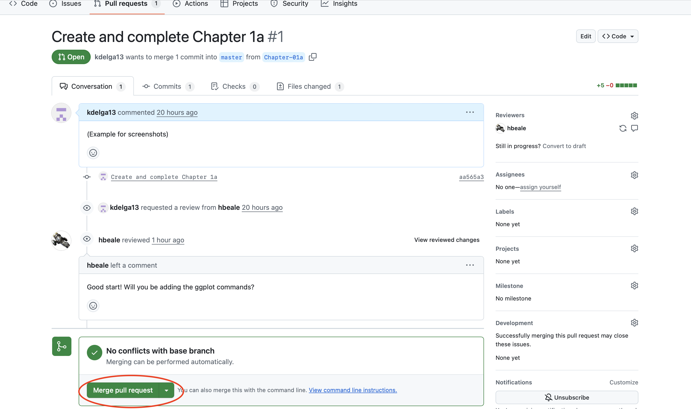
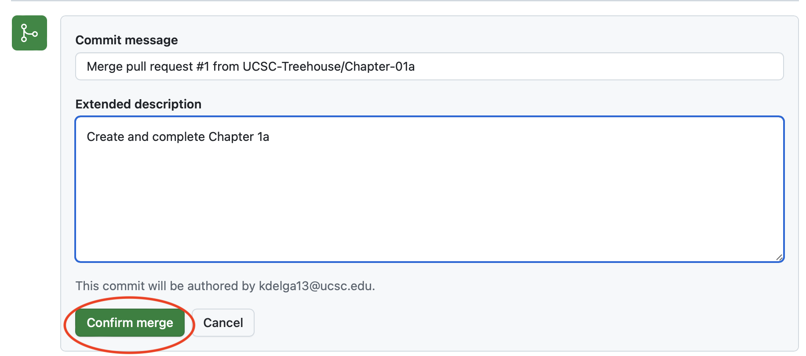
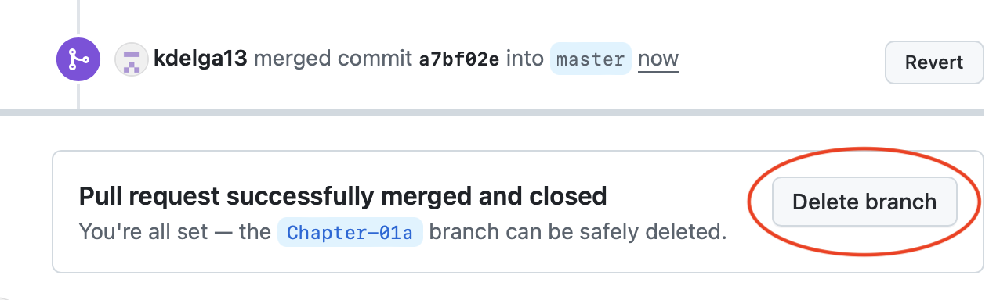
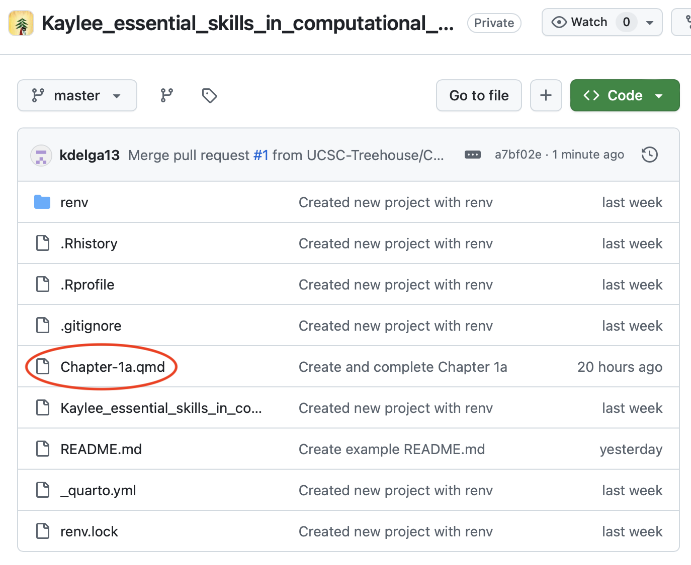
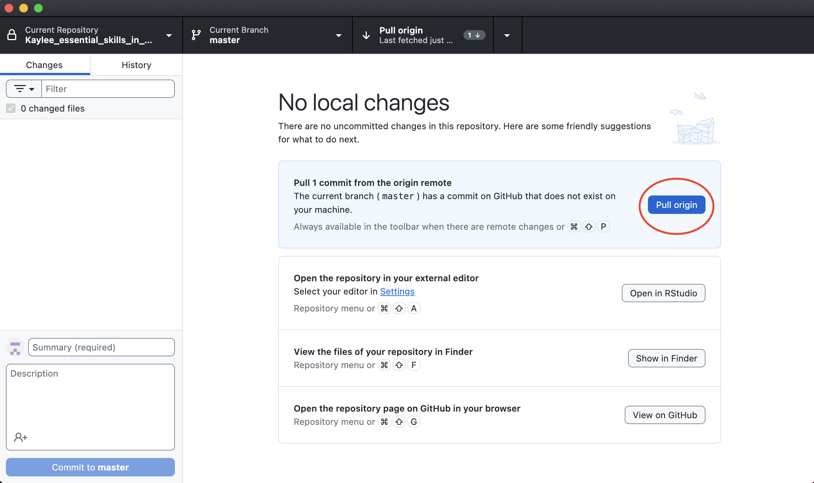

# Chapter 01c, GitHub

**That was a lot!**

This chapter will be brief. You will learn what happens after you make
your pull request and your mentor approves it.

------------------------------------------------------------------------

Now your mentor can review your work while making some suggested
changes, where needed. After your mentor does this, when you return to
GitHub Desktop and are under the ‘Chapter-01a’ or “Chapter-01b” branch,
you will see your saved, unchanged work in **green** and your mentor’s
changes (or any new changes you have made too) in **red**. The red
signifies *any* new change that has not been committed and pushed to a
branch.

After adding their comments, your mentor will accept your pull request
on GitHub. Here’s what happens and what you’ll do:

1.  Merge the Pull Request

Once your mentor approves the pull request, you can officially merge the
changes into your main branch. You will be prompted with the following:

2.  Delete the Branch

After the merge, you will be prompted to *safely* delete your chapter’s
branch.

3.  Sync Your Local Repository

After the merge is complete, you will see the new Chapter 1 Quarto
documents in your GitHub.

Now, navigate to your local copy and check the files. Do you see the new
changes in your file?

While your mentors new edits appear on GitHub after the merge, they will
not be reflected in your *local* repository. To sync these changes to
your local repository, you will need to “pull” them from GitHub.

Open GitHub desktop. You should see a highlighted blue bar prompting you
to “Pull 1 commit from the origin remote”. Click “Pull origin”.

Now the remote and local repositories are synced! (**Hint**: Anytime you
make changes to either the remote (e.g. on GitHub) or the local
repository, you will need to sync them to keep both versions up to
date.)

------------------------------------------------------------------------

**NEXT UP:** [Chapter
2](https://github.com/UCSC-Treehouse/Essential-skills-for-Treehouse-computational-research/blob/main/Chapter-Instructions/Chapter_02_Instructions.md)
