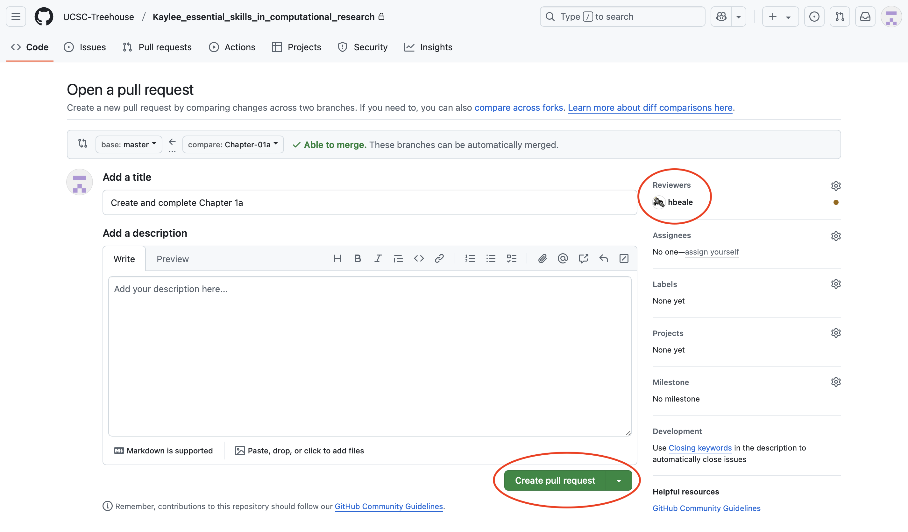

# Chapter 01c, GitHub

**That was a lot!** Now, to wrap up Chapter 1 you will learn to use
GitHub to make your work viewable to others (and also reproducible!) You
will create a new branch on GitHub and push your Chapter 1 work to that
branch, creating a pull request in the process. This pull request will
allow a mentor to review your work each chapter.

------------------------------------------------------------------------

Remember that Chapter 1 branch you created? After you save your Quarto
notebook, you are going to push all of your new Chapter 1 changes to
that branch on GitHub, so your work will be viewable on the
UCSC-Treehouse organization.

Lastly, you will request your mentor as a ‘reviewer’, so they can check
over your work *before* you officially push it to the main branch.

Navigate back to **GitHub Desktop**… You should see your new changes
highlighted in red.

1.  Push new Chapter 1 changes to chapter-01 branch

2.  Publish the new chapter-01 branch

3.  Create a pull request

You will be relocated to the **GitHub browser**.

1.  Add your mentor as a reviewer (**Note**: here I use ‘hbeale’ but
    make sure you are adding *your* mentor’s GitHub id)

Now your mentor can review your work while making some suggested
changes, where needed. After your mentor does this, when you return to
GitHub Desktop and are under the ‘chapter-01’ branch, you will see your
saved, unchanged work in **green** and your mentor’s changes (or any new
changes you have made too) in **red**. The red signifies *any* new
change that has not been committed and pushed to a branch.

------------------------------------------------------------------------

**NEXT UP:** [Chapter
2](https://github.com/UCSC-Treehouse/Essential-skills-for-Treehouse-computational-research/blob/main/Chapter-Instructions/Chapter_02_Instructions.md)
