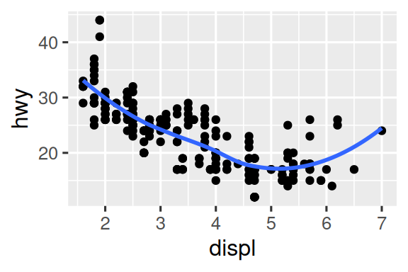

# Chapter 9, Layers


Earlier we explored making plots with ggplot2. In this chapter, you’ll
expand on that foundation as you learn about the layered grammar of
graphics. We’ll start with a deeper dive into aesthetic mappings,
geometric objects, and facets. Then, you will learn about statistical
transformations ggplot2 makes under the hood when creating a plot. These
transformations are used to calculate new values to plot, such as the
heights of bars in a bar plot or medians in a box plot. You will also
learn about position adjustments, which modify how geoms are displayed
in your plots. Finally, we’ll briefly introduce coordinate systems.

------------------------------------------------------------------------

## Prerequisites

``` r
library(tidyverse)
```

    ── Attaching core tidyverse packages ──────────────────────── tidyverse 2.0.0 ──
    ✔ dplyr     1.1.4     ✔ readr     2.1.5
    ✔ forcats   1.0.0     ✔ stringr   1.5.1
    ✔ ggplot2   3.5.2     ✔ tibble    3.2.1
    ✔ lubridate 1.9.3     ✔ tidyr     1.3.1
    ✔ purrr     1.0.4     
    ── Conflicts ────────────────────────────────────────── tidyverse_conflicts() ──
    ✖ dplyr::filter() masks stats::filter()
    ✖ dplyr::lag()    masks stats::lag()
    ℹ Use the conflicted package (<http://conflicted.r-lib.org/>) to force all conflicts to become errors

------------------------------------------------------------------------

## Aesthetic Mappings

Remember that the mpg data frame bundled with the ggplot2 package
contains 234 observations on 38 car models.

``` r
mpg
```

Among the variables in mpg are:

1.  displ: A car’s engine size, in liters. A numerical variable.

2.  hwy: A car’s fuel efficiency on the highway, in miles per gallon
    (mpg). A car with a low fuel efficiency consumes more fuel than a
    car with a high fuel efficiency when they travel the same distance.
    A numerical variable.

3.  class: Type of car. A categorical variable.

Let’s start by visualizing the relationship between displ and hwy for
various classes of cars. We can do this with a scatterplot where the
numerical variables are mapped to the x and y aesthetics and the
categorical variable is mapped to an aesthetic like color or shape.

``` r
# Left
ggplot(mpg, aes(x = displ, y = hwy, color = class)) +
  geom_point()

# Right
ggplot(mpg, aes(x = displ, y = hwy, shape = class)) +
  geom_point()
```

When class is mapped to shape, we get two warnings.

Since ggplot2 will only use six shapes at a time, by default, additional
groups will go unplotted when you use the shape aesthetic. The second
warning is related – there are 62 SUVs in the dataset and they’re not
plotted.

Similarly, we can map class to size or alpha aesthetics as well, which
control the size and the transparency of the points, respectively.

``` r
# Left
ggplot(mpg, aes(x = displ, y = hwy, size = class)) +
  geom_point()

# Right
ggplot(mpg, aes(x = displ, y = hwy, alpha = class)) +
  geom_point()
```

Both of these produce warnings as well.

Mapping an unordered discrete (categorical) variable (class) to an
ordered aesthetic (size or alpha) is generally not a good idea because
it implies a ranking that does not in fact exist.

Once you map an aesthetic, ggplot2 takes care of the rest. It selects a
reasonable scale to use with the aesthetic, and it constructs a legend
that explains the mapping between levels and values. For x and y
aesthetics, ggplot2 does not create a legend, but it creates an axis
line with tick marks and a label. The axis line provides the same
information as a legend; it explains the mapping between locations and
values.

You can also set the visual properties of your geom manually as an
argument of your geom function (outside of aes()) instead of relying on
a variable mapping to determine the appearance. For example, we can make
all of the points in our plot blue:

``` r
ggplot(mpg, aes(x = displ, y = hwy)) + 
  geom_point(color = "blue")
```

Here, the color doesn’t convey information about a variable, but only
changes the appearance of the plot. You’ll need to pick a value that
makes sense for that aesthetic.

Learn more about all possible aesthetic mappings in the aesthetic
specifications vignette at
https://ggplot2.tidyverse.org/articles/ggplot2-specs.html.

------------------------------------------------------------------------

## Exercises pt 1 of 6 (you got this!)

1.  Create a scatterplot of hwy vs. displ where the points are pink
    filled in triangles.

2.  Why did the following code not result in a plot with blue points?

``` r
ggplot(mpg) + 
  geom_point(aes(x = displ, y = hwy, color = "blue"))
```

3.  What does the stroke aesthetic do? What shapes does it work with?
    (**Hint**: use ?geom_point)

4.  What happens if you map an aesthetic to something other than a
    variable name, like aes(color = displ \< 5)? Note, you’ll also need
    to specify x and y.

------------------------------------------------------------------------

## Geometric Objects

To change the geom in your plot, change the geom function that you add
to ggplot(). For instance, the following code produces two plots that
represent the same data (mpg):

``` r
ggplot(mpg, aes(x = displ, y = hwy)) + 
  geom_point()

ggplot(mpg, aes(x = displ, y = hwy)) + 
  geom_smooth()
```

Every geom function in ggplot2 takes a mapping argument, either defined
locally in the geom layer or globally in the ggplot() layer. However,
not every aesthetic works with every geom. You could set the shape of a
point, but you couldn’t set the “shape” of a line. If you try, ggplot2
will silently ignore that aesthetic mapping. On the other hand, you
*could* set the linetype of a line. geom_smooth() will draw a different
line, with a different linetype, for each unique value of the variable
that you map to linetype.

``` r
ggplot(mpg, aes(x = displ, y = hwy, shape = drv)) + 
  geom_smooth()
```

    `geom_smooth()` using method = 'loess' and formula = 'y ~ x'


``` r
ggplot(mpg, aes(x = displ, y = hwy, linetype = drv)) + 
  geom_smooth()
```

    `geom_smooth()` using method = 'loess' and formula = 'y ~ x'


Here, geom_smooth() separates the cars into three lines based on their
drv value, which describes a car’s drive train. One line describes all
of the points that have a 4 value, one line describes all of the points
that have an f value, and one line describes all of the points that have
an r value. Here, 4 stands for four-wheel drive, f for front-wheel
drive, and r for rear-wheel drive.

If this sounds strange, we can make it clearer by overlaying the lines
on top of the raw data and then coloring everything according to drv.

``` r
ggplot(mpg, aes(x = displ, y = hwy, color = drv)) + 
  geom_point() +
  geom_smooth(aes(linetype = drv))
```

Many geoms, like geom_smooth(), use a single geometric object to display
multiple rows of data. For these geoms, you can set the group aesthetic
to a categorical variable to draw multiple objects. ggplot2 will draw a
separate object for each unique value of the grouping variable. In
practice, ggplot2 will automatically group the data for these geoms
whenever you map an aesthetic to a discrete variable (as in the linetype
example). It is convenient to rely on this feature because the group
aesthetic by itself does not add a legend or distinguishing features to
the geoms.

``` r
ggplot(mpg, aes(x = displ, y = hwy)) +
  geom_smooth()

ggplot(mpg, aes(x = displ, y = hwy)) +
  geom_smooth(aes(group = drv))

ggplot(mpg, aes(x = displ, y = hwy)) +
  geom_smooth(aes(color = drv), show.legend = FALSE)
```

If you place mappings in a geom function, ggplot2 will treat them as
local mappings for the layer. It will use these mappings to extend or
overwrite the global mappings *for that layer only*. This makes it
possible to display different aesthetics in different layers.

``` r
ggplot(mpg, aes(x = displ, y = hwy)) + 
  geom_point(aes(color = class)) + 
  geom_smooth()
```

You can use the same idea to specify different data for each layer.
Here, we use red points as well as open circles to highlight two-seater
cars. The local data argument in geom_point() overrides the global data
argument in ggplot() for that layer only.

``` r
ggplot(mpg, aes(x = displ, y = hwy)) + 
  geom_point() + 
  geom_point(
    data = mpg |> filter(class == "2seater"), 
    color = "red"
  ) +
  geom_point(
    data = mpg |> filter(class == "2seater"), 
    shape = "circle open", size = 3, color = "red"
  )
```

Geoms are the fundamental building blocks of ggplot2. You can completely
transform the look of your plot by changing its geom, and different
geoms can reveal different features of your data. For example, the
histogram and density plot below reveal that the distribution of highway
mileage is bimodal and right skewed while the boxplot reveals two
potential outliers.

``` r
ggplot(mpg, aes(x = hwy)) +
  geom_histogram(binwidth = 2)

ggplot(mpg, aes(x = hwy)) +
  geom_density()

ggplot(mpg, aes(x = hwy)) +
  geom_boxplot()
```

ggplot2 provides more than 40 geoms but these don’t cover all possible
plots one could make. If you need a different geom, we recommend looking
into extension packages first to see if someone else has already
implemented it (see https://exts.ggplot2.tidyverse.org/gallery/ for a
sampling). For example, the **ggridges** package
(https://wilkelab.org/ggridges) is useful for making ridgeline plots,
which can be useful for visualizing the density of a numerical variable
for different levels of a categorical variable. In the following plot
not only did we use a new geom (geom_density_ridges()), but we have also
mapped the same variable to multiple aesthetics (drv to y, fill, and
color) as well as set an aesthetic (alpha = 0.5) to make the density
curves transparent.

``` r
library(ggridges)

ggplot(mpg, aes(x = hwy, y = drv, fill = drv, color = drv)) +
  geom_density_ridges(alpha = 0.5, show.legend = FALSE)
```

------------------------------------------------------------------------

## Exercises pt 2 of 6

1.  What geom would you use to draw a line chart? A boxplot? A
    histogram? An area chart?

2.  Earlier in this chapter we used show.legend without explaining it:

``` r
ggplot(mpg, aes(x = displ, y = hwy)) +
  geom_smooth(aes(color = drv), show.legend = FALSE)
```

What does show.legend = FALSE do here? What happens if you remove it?
Why do you think we used it earlier?

3.  What does the se argument to geom_smooth() do?

4.  Recreate the R code necessary to generate the following graphs. Note
    that wherever a categorical variable is used in the plot, it’s drv.

<div id="fig-cars">



Figure 1: Cars engine size (displ) and cars fuel efficiency on highways
in mpg package

</div>

------------------------------------------------------------------------

## Facets

In Chapter 1 you learned about faceting with facet_wrap(), which splits
a plot into subplots that each display one subset of the data based on a
categorical variable.

``` r
ggplot(mpg, aes(x = displ, y = hwy)) + 
  geom_point() + 
  facet_wrap(~cyl)
```

To facet your plot with the combination of two variables, switch from
facet_wrap() to facet_grid(). The first argument of facet_grid() is also
a formula, but now it’s a double sided formula: rows ~ cols.

``` r
ggplot(mpg, aes(x = displ, y = hwy)) + 
  geom_point() + 
  facet_grid(drv ~ cyl)
```

By default each of the facets share the same scale and range for x and y
axes. This is useful when you want to compare data across facets but it
can be limiting when you want to visualize the relationship within each
facet better. Setting the scales argument in a faceting function to
“free_x” will allow for different scales of x-axis across columns,
“free_y” will allow for different scales on y-axis across rows, and
“free” will allow both.

``` r
ggplot(mpg, aes(x = displ, y = hwy)) + 
  geom_point() + 
  facet_grid(drv ~ cyl, scales = "free")
```


------------------------------------------------------------------------

## Exercises pt 3 of 6

1.  What happens if you facet on a continuous variable?

2.  What do the empty cells in the plot above with facet_grid(drv ~ cyl)
    mean? Run the following code. How do they relate to the resulting
    plot?

``` r
ggplot(mpg) + 
  geom_point(aes(x = drv, y = cyl))
```

3.  What plots does the following code make? What does . do?

``` r
ggplot(mpg) + 
  geom_point(aes(x = displ, y = hwy)) +
  facet_grid(drv ~ .)

ggplot(mpg) + 
  geom_point(aes(x = displ, y = hwy)) +
  facet_grid(. ~ cyl)
```

4.  Take the first faceted plot in this section:

``` r
ggplot(mpg) + 
  geom_point(aes(x = displ, y = hwy)) + 
  facet_wrap(~ cyl, nrow = 2)
```

What are the advantages to using faceting instead of the color
aesthetic? What are the disadvantages? How might the balance change if
you had a larger dataset?

5.  Read ?facet_wrap. What does nrow do? What does ncol do? What other
    options control the layout of the individual panels? Why doesn’t
    facet_grid() have nrow and ncol arguments?

6.  Which of the following plots makes it easier to compare engine size
    (displ) across cars with different drive trains? What does this say
    about when to place a faceting variable across rows or columns?

``` r
ggplot(mpg, aes(x = displ)) + 
  geom_histogram() + 
  facet_grid(drv ~ .)

ggplot(mpg, aes(x = displ)) + 
  geom_histogram() +
  facet_grid(. ~ drv)
```

7.  Recreate the following plot using facet_wrap() instead of
    facet_grid(). How do the positions of the facet labels change?

``` r
ggplot(mpg) + 
  geom_point(aes(x = displ, y = hwy)) +
  facet_grid(drv ~ .)
```

------------------------------------------------------------------------

## Statistical Transformations

Consider a basic bar chart, drawn with geom_bar() or geom_col(). The
following chart displays the total number of diamonds in the diamonds
dataset, grouped by cut. The diamonds dataset is in the ggplot2 package
and contains information on ~54,000 diamonds, including the price,
carat, color, clarity, and cut of each diamond. The chart shows that
more diamonds are available with high quality cuts than with low quality
cuts.

``` r
ggplot(diamonds, aes(x = cut)) + 
  geom_bar()
```

On the x-axis, the chart displays cut, a variable from diamonds. On the
y-axis, it displays count, but count is not a variable in diamonds!
Where does count come from? Many graphs, like scatterplots, plot the raw
values of your dataset. Other graphs, like bar charts, calculate new
values to plot:

- Bar charts, histograms, and frequency polygons bin your data and then
  plot bin counts, the number of points that fall in each bin.

- Smoothers fit a model to your data and then plot predictions from the
  model.

- Boxplots compute the five-number summary of the distribution and then
  display that summary as a specially formatted box.

The algorithm used to calculate new values for a graph is called a stat,
short for statistical transformation. You can learn which stat a geom
uses by inspecting the default value for the stat argument. For example,
?geom_bar shows that the default value for stat is “count”, which means
that geom_bar() uses stat_count(). stat_count() is documented on the
same page as geom_bar(). If you scroll down, the section called
“Computed variables” explains that it computes two new variables: count
and prop.

Every geom has a default stat; and every stat has a default geom. This
means that you can typically use geoms without worrying about the
underlying statistical transformation. However, there are three reasons
why you might need to use a stat explicitly:

1.  You might want to override the default stat. In the code below, we
    change the stat of geom_bar() from count (the default) to identity.
    This lets us map the height of the bars to the raw values of a y
    variable.

``` r
diamonds |>
  count(cut) |>
  ggplot(aes(x = cut, y = n)) +
  geom_bar(stat = "identity")
```

2.  You might want to override the default mapping from transformed
    variables to aesthetics. For example, you might want to display a
    bar chart of proportions, rather than counts:

``` r
ggplot(diamonds, aes(x = cut, y = after_stat(prop), group = 1)) + 
  geom_bar()
```

3.  You might want to draw greater attention to the statistical
    transformation in your code. For example, you might use
    stat_summary(), which summarizes the y values for each unique x
    value, to draw attention to the summary that you’re computing:

``` r
ggplot(diamonds) + 
  stat_summary(
    aes(x = cut, y = depth),
    fun.min = min,
    fun.max = max,
    fun = median
  )
```

------------------------------------------------------------------------

## Exercises pt 4 of 6

1.  What is the default geom associated with stat_summary()? How could
    you rewrite the previous plot to use that geom function instead of
    the stat function?

2.  What does geom_col() do? How is it different from geom_bar()?

3.  Most geoms and stats come in pairs that are almost always used in
    concert. Make a list of all the pairs. What do they have in common?
    (**Hint**: Read through the documentation.)

4.  What variables does stat_smooth() compute? What arguments control
    its behavior?

5.  In our proportion bar chart, we needed to set group = 1. Why? In
    other words, what is the problem with these two graphs?

``` r
ggplot(diamonds, aes(x = cut, y = after_stat(prop))) + 
  geom_bar()
ggplot(diamonds, aes(x = cut, fill = color, y = after_stat(prop))) + 
  geom_bar()
```

------------------------------------------------------------------------

## Position Adjustments

You can color a bar chart using either the color aesthetic, or, more
usefully, the fill aesthetic:

``` r
ggplot(mpg, aes(x = drv, color = drv)) + 
  geom_bar()

ggplot(mpg, aes(x = drv, fill = drv)) + 
  geom_bar()
```

Note what happens if you map the fill aesthetic to another variable,
like class: the bars are automatically stacked. Each colored rectangle
represents a combination of drv and class.

``` r
ggplot(mpg, aes(x = drv, fill = class)) + 
  geom_bar()
```

The stacking is performed automatically using the **position
adjustment** specified by the position argument. If you don’t want a
stacked bar chart, you can use one of three other options: “identity”,
“dodge” or “fill”.

- position = “identity” will place each object exactly where it falls in
  the context of the graph. This is not very useful for bars, because it
  overlaps them. To see that overlapping we either need to make the bars
  slightly transparent by setting alpha to a small value, or completely
  transparent by setting fill = NA.

``` r
ggplot(mpg, aes(x = drv, fill = class)) + 
  geom_bar(alpha = 1/5, position = "identity")

ggplot(mpg, aes(x = drv, color = class)) + 
  geom_bar(fill = NA, position = "identity")
```

The identity position adjustment is more useful for 2d geoms, like
points, where it is the default.

- position = “fill” works like stacking, but makes each set of stacked
  bars the same height. This makes it easier to compare proportions
  across groups.

- position = “dodge” places overlapping objects directly beside one
  another. This makes it easier to compare individual values.

``` r
ggplot(mpg, aes(x = drv, fill = class)) + 
  geom_bar(position = "fill")

ggplot(mpg, aes(x = drv, fill = class)) + 
  geom_bar(position = "dodge")
```

There’s one other type of adjustment that’s not useful for bar charts,
but can be very useful for scatterplots. Recall our first scatterplot.
Did you notice that the plot displays only 126 points, even though there
are 234 observations in the dataset?

The underlying values of hwy and displ are rounded so the points appear
on a grid and many points overlap each other. This problem is known as
**overplotting**. This arrangement makes it difficult to see the
distribution of the data. Are the data points spread equally throughout
the graph, or is there one special combination of hwy and displ that
contains 109 values?

You can avoid this gridding by setting the position adjustment to
“jitter”. position = “jitter” adds a small amount of random noise to
each point. This spreads the points out because no two points are likely
to receive the same amount of random noise.

``` r
ggplot(mpg, aes(x = displ, y = hwy)) + 
  geom_point(position = "jitter")
```

Adding randomness seems like a strange way to improve your plot, but
while it makes your graph less accurate at small scales, it makes your
graph more revealing at large scales. Because this is such a useful
operation, ggplot2 comes with a shorthand for geom_point(position =
“jitter”): geom_jitter().

------------------------------------------------------------------------

## Exercises pt 5 of 6

1.  What is the problem with the following plot? How could you improve
    it?

``` r
ggplot(mpg, aes(x = cty, y = hwy)) + 
  geom_point()
```

2.  What, if anything, is the difference between the two plots? Why?

``` r
ggplot(mpg, aes(x = displ, y = hwy)) +
  geom_point()
ggplot(mpg, aes(x = displ, y = hwy)) +
  geom_point(position = "identity")
```

3.  What parameters to geom_jitter() control the amount of jittering?

4.  Compare and contrast geom_jitter() with geom_count().

5.  What’s the default position adjustment for geom_boxplot()? Create a
    visualization of the mpg dataset that demonstrates it.

------------------------------------------------------------------------

## Coordinate Systems

**Coordinate systems** are probably the most complicated part of
ggplot2. The default coordinate system is the Cartesian coordinate
system where the x and y positions act independently to determine the
location of each point. There are two other coordinate systems that are
occasionally helpful.

- coord_quickmap() sets the aspect ratio correctly for geographic maps.
  This is very important if you’re plotting spatial data with ggplot2.

``` r
nz <- map_data("nz")

ggplot(nz, aes(x = long, y = lat, group = group)) +
  geom_polygon(fill = "white", color = "black")

ggplot(nz, aes(x = long, y = lat, group = group)) +
  geom_polygon(fill = "white", color = "black") +
  coord_quickmap()
```

- coord_polar() uses polar coordinates. Polar coordinates reveal an
  interesting connection between a bar chart and a Coxcomb chart.

``` r
bar <- ggplot(data = diamonds) + 
  geom_bar(
    mapping = aes(x = clarity, fill = clarity), 
    show.legend = FALSE,
    width = 1
  ) + 
  theme(aspect.ratio = 1)

bar + coord_flip()
bar + coord_polar()
```

------------------------------------------------------------------------

## Exercises pt 6 of 6 (you made it!)

1.  Turn a stacked bar chart into a pie chart using coord_polar().

2.  What’s the difference between coord_quickmap() and coord_map()?

3.  What does the following plot tell you about the relationship between
    city and highway mpg? Why is coord_fixed() important? What does
    geom_abline() do?

``` r
ggplot(data = mpg, mapping = aes(x = cty, y = hwy)) +
  geom_point() + 
  geom_abline() +
  coord_fixed()
```

------------------------------------------------------------------------

## The Layered Grammar of Graphics

We can expand on the graphing template you learned in Chapter 1 by
adding position adjustments, stats, coordinate systems, and faceting:

``` {|}
  ggplot(data = <DATA>) + 
    <GEOM_FUNCTION>(
      mapping = aes(<MAPPINGS>),
      stat = <STAT>, 
      position = <POSITION>
    ) +
    <COORDINATE_FUNCTION> +
    <FACET_FUNCTION>
```

Our new template takes seven parameters, the bracketed words that appear
in the template. In practice, you rarely need to supply all seven
parameters to make a graph because ggplot2 will provide useful defaults
for everything except the data, the mappings, and the geom function.

------------------------------------------------------------------------

**NEXT UP:** [Chapter
10](https://github.com/UCSC-Treehouse/Essential-skills-for-Treehouse-computational-research/blob/main/Chapter-Instructions/Chapter_10_Instructions.md)
